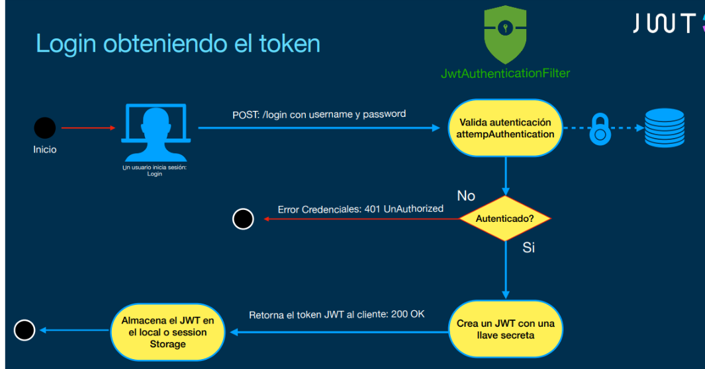
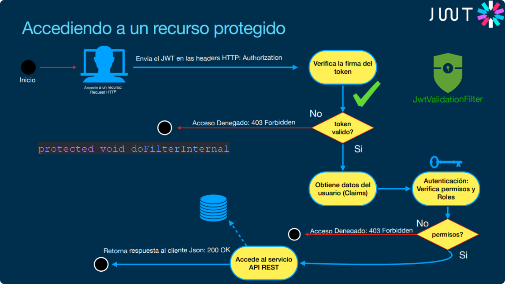

This project is a user login system with roles, the frontend is written with react using redux and the backend is written in java using spring security

The project is based on the course
https://www.udemy.com/share/108wH83@sUOci0WLaluOUSaQ3CDuW16yEIoNG97ElGCJM2o2Cbl8LXIRPxajjJwF8QlbhqDiEg==/

Spring security was used to generate the token

Spring security was used to validaton the token

I used the aws-rds database resource, it took off the front on S3 and the backend on EC2

Deploy UsersApp

Quick guide deploy in aws rds and ec2
[deploy rds](doc/deploy%20aws-rds.pdf)
[deploy ec2](doc/deploy-ec2.pdf)

FrontEnd repository: https://github.com/theinsideshine/react-users-app
